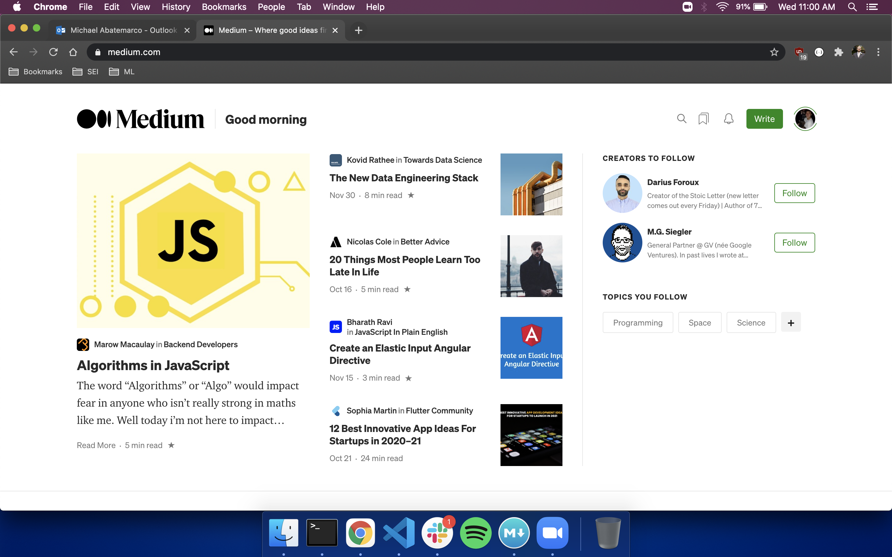
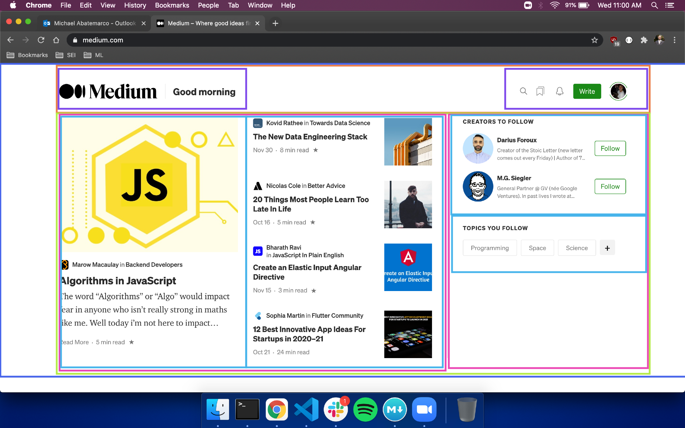
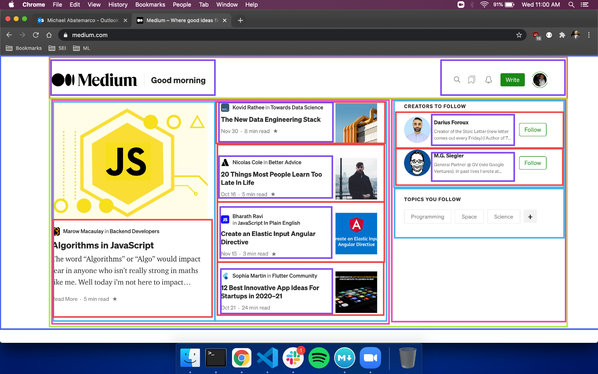

# CSS


For many of us, CSS is an annoying necessity. For something that most of us consider to be a minor part of coding, it can be annoying that it can take up as much time as it does.  Unless you're going to specialize in front-end design, we can rely on a few simple CSS principles to be effective with minimal work.

## General CSS Tips

### CSS Reset

It's easy to get turned around by default styling.  Most elements in CSS come with pre-written styling, and this can cause problems when you're not expecting it.  It's always smart to start off your css file with a reset, that nullifies the default styling so that every bit of styling is your own.  There are css reset files out there that you can use, but for a quick and dirty version, just put this at the top of your css file:

```css
* {
    margin: 0;
    padding: 0;
    border: 0;
    box-sizing: border-box;
	font: inherit;
}
```

### Sizing and Responsive Design

Defining sizes for our elements can also be frustrating. With the variety of screens our there, it's impossible to design for just one, and multiple designs are often necessary.  Besides media queries, how we define size is the best tool we have to keep our sites responsive.

Most of the concern with responsive design is width.  Usually, we do not want the height of elements to change much, so it's often good practice to set height with px. Setting width should always be done with responsiveness in mind, using either % or vw.

- vw: When we set width using vw, or view width, we're setting size based on a percentage of the total width of the app. A setting of '40vw' sets the width to 40% of the total screen's width. We should use vw to set the width of larger elements of the site that define the general layout.
- %: When we set width using %, we're setting size based on a percentage of the parent element.  It's usually good practice to set width using % for children elements. We could also use vw, but that isn't relative to the size of the parent, and if we decide to change the size of the parent, we also need to go in and change the size of the child elements to maintain their relative sizes.  If we use % for child elements, they change size as their parent does.

Another amazingly useful tool in sizing is
	
	box-sizing: border-box;
	
Normally, the widths, padding, and borders of an element are separate, and we need to calculate the sum of them to get the full width of the element.  When we get box-sizing to border-box, the size of the padding and borders now come out of the defined width of the element, not added to it.

### Selectors

Selecting elements in css can get hairy, but there are some tricks that you can use to avoid having to cram tons of classes and ids into your html. Feel free to look over a list of useful selectors [here](https://gist.github.com/magicznyleszek/809a69dd05e1d5f12d01).

We want to be as specific as possible when selecting elements, as we want to avoid effecting elements we don't intend to.

What you'll be using, mostly, is selectors chaining to select child elements.  Consider this code.

```html
<div className='collections'>
	<div>
		<div className='shadow-box'>
			<h1>Winter Collection</h1>
       </div>
       <p>Check out some of our holiday offerings.</p>
	</div>
</div>
```

Setting the css for these elements can get wordy.  It might look like this:

```css
.collections{
	width:20%;
	height:400px
}

.collections div{
	width:100%;
	border: 1px solid black;
	box-sizing: border-box
}

.collections div p{
	font-size: 20px;
}

.shadow-box{
	margin: 3vh 5vw;
	background-color: grey;
}

.shadow-box h1{
	font-size: 30px;
}
```

### Sass

Sass is a css compiler that allows us to write css with certain conveniences, which sass then compiles into a css file.  To get sass, type

	npm install -g sass
	
in your command line.  As we work on our site, we link our css file as usual. Let's say this css file is to be called 'style.css'.  We also create a sass file, denoted by the file extension .scss. We'll call this file style.scss.  We can now write our css in our sass file, and it will live update our regular css file as we go.  We just need to run the command

	sass --watch style.scss:style.css
	
Now we have sass.  Sass provides a lot of extra functionality and convenience, which you can learn more about [here](https://sass-lang.com/guide).  My favorite part of sass is the ability to nest css.  We can rewrite the css from the section above like this now:

```css
.collections{
	width:20%;
	height:400px
	
	div{
		width:100%;
		border: 1px solid black;
		box-sizing: border-box
		
		.shadow-box{
			margin: 3vh 5vw;
			background-color: grey;
			
			h1{
				font-size: 30px;
			}
		}
	
		p{
			font-size: 20px;
		}
	}
}
```

Not only is it shorter, but a lot more readable, and we can structure our css in a similar way to our html, which makes it easier to switch back and forth.

## Flexbox

Flexbox is one of the most powerful and useful css tools that exists.  It's adaptable to a range of situations, and is an easy solution to almost every kind of horizontal (and many vertical) layouts. [Here](https://css-tricks.com/snippets/css/a-guide-to-flexbox/) is a wonderful and complete guide to using flexbox.

Flexbox has a lot of useful features, but you'll find that just a few are used regularly.

Flex is applied to the parent container, and by default sets the container to lay our its children horizontally.


To set this up, we just set the 'display' property to flex, like so:

```css
.container{
	display:flex;
}
```

### Horizontal Spacing

One of the hardest things about laying things our horizontally is spacing them nicely. Trying to space the elements and maintain a single line can be tricky, but flexbox has us covered. Adding the 'justify-content' property to the flexed (container) element will automatically space our elements in a number of ways.

```css
.container{
	display:flex;
	justify-content: flex-start OR flex-end OR center OR space-between OR space-evenly ETC
}
```


### Vertically Align

Aligning elements vertically within a container can also be a pain, most often in the case of centering elements vertically, as in a header.  Flexbox can also do this for us, and for this reason it's often convenient to set a container to flex even if we only have a single element in it.  For this, we use the 'align-items' property.

```css
.container{
	display:flex;
	justify-content: flex-start OR flex-end OR center OR space-between OR space-evenly ETC;
	align-items: flex-start OR flex-end OR center ETC;
}
```


### Multiple Lines

Flexbox is great for a single line, as it will fit all of the children elements to a single horizontal layout, but what if we want multiple lines, like in a grid layout?  For this, we use the 'flex-wrap' element on the parent container.  The flexbox will align as many items as width will allow on one line, then move the next to the following line.

```css
.container{
	display:flex;
	justify-content: flex-start OR flex-end OR center OR space-between OR space-evenly ETC;
	align-items: flex-start OR flex-end OR center ETC;
	flex-wrap: wrap;
}
```


These few flexbox methods allow us to create any number of layouts on our sites, especially when we start nesting flexboxes.  The trick now, is to plan our pages with these flexbox abilities in mind.

## The box model

The box model is the basis on which css is organized, and understanding it is the most important thing you can do to improve your css.


A lot of writing good css is writing good html, and understanding how to group elements is how we write good html.  Our goal is to create boxes whenever we have a group of elements that share properties, like a margin or border.  With flexbox in mind, we can start boxing up element according to spacing and layout.

Let's try recreating a site layout.  We're going to use medium as our template.  A good rule of thumb when creating groups to flexbox is to group any set of elements that are uniquely spaces from other sets of elements, and any groups of elements with vertical layouts within a horizontal layour, or vice versa.







